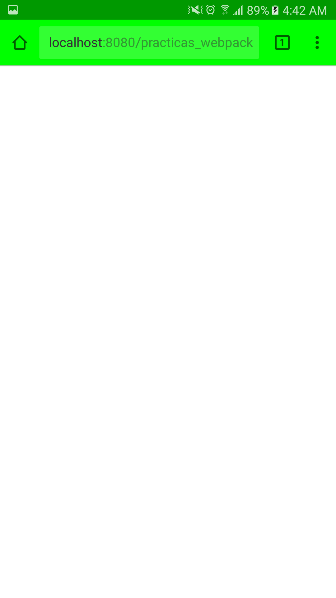

# Significado de archivos .rc
- runcom
- run commands
- resource control
- run control
- runtime configuration

# Visual Studio Code
* [Configuración](https://code.visualstudio.com/docs/getstarted/settings) - Configuración del espacio de trabajo.
# Utiliades
* [Markdown Preview Enhanced](https://marketplace.visualstudio.com/items?itemName=shd101wyy.markdown-preview-enhanced) Para visualizar la redacción del archivo .md (markdown) (ctrl + shift + m to show).
* [Apache Conf](https://marketplace.visualstudio.com/items?itemName=mrmlnc.vscode-apache) - Resaltado de sintaxis para archivos conf de Apache en código de Visual Studio.
* [Import Cost VSCode Extension](https://marketplace.visualstudio.com/items?itemName=wix.vscode-import-cost) - Calcula el tamaño de la importanción a un script
# Plugins recomendados

## Aspecto del editor
* [One Dark Pro](https://marketplace.visualstudio.com/items?itemName=zhuangtongfa.Material-theme) - Tema para el editor
* [seti-icons](https://marketplace.visualstudio.com/items?itemName=qinjia.seti-icons) - Tema de para los iconos

## Configuración del editor
* [EditorConfig for VS Code](https://marketplace.visualstudio.com/items?itemName=EditorConfig.EditorConfig) - Ayuda a los desarrolladores a definir y mantener estilos de codigo consistentes entre diferentes editores e IDE's a través de un archivo .editorconfig

## Mejora del editor
* [Path Intellisense](https://marketplace.visualstudio.com/items?itemName=christian-kohler.path-intellisense) - Autoacompleta nombres de archivo.

## Frontend
##### JavaScript
* [js-hint](https://marketplace.visualstudio.com/items?itemName=dbaeumer.jshint) Nota*: Necesita instalar jshint vía npm install -g jshint y un archivo .jshintrc
* [Sublime Babel](https://marketplace.visualstudio.com/items?itemName=joshpeng.sublime-babel-vscode) - Sintaxis de babel recomendada por [Babel para VSCode](https://babeljs.io/docs/editors).
* [BEM Expand for VS Code](https://marketplace.visualstudio.com/items?itemName=lukazakrajsek.bem-expand) Nota*: Pendiente aprender a usarlo
* [npm Intellisense](https://marketplace.visualstudio.com/items?itemName=christian-kohler.npm-intellisense) - Autocompleta modulos npm en sentencias import.
##### CSS
* [SCSS IntelliSense](https://marketplace.visualstudio.com/items?itemName=mrmlnc.vscode-scss) - Autocompletado para SASS y refactorización

## Backend
##### PHP
* [PHP DocBlocker](https://marketplace.visualstudio.com/items?itemName=neilbrayfield.php-docblocker) - Extensión para documentar código php (/**)
* [PHP Formatter](https://marketplace.visualstudio.com/items?itemName=Sophisticode.php-formatter) - Extensión para formatear código php
* [PHP IntelliSense](https://marketplace.visualstudio.com/items?itemName=felixfbecker.php-intellisense) - Autoacompletado y refactorización para PHP
* [PHP Intellisense - Crane](https://marketplace.visualstudio.com/items?itemName=HvyIndustries.crane) - Sugerencia de código
* [PHP intellisense for codeigniter](https://marketplace.visualstudio.com/items?itemName=small.php-ci) - Sugerencia de código para CodeIgniter
##### MySQL
* [mysql-inline-decorator](https://marketplace.visualstudio.com/items?itemName=odubuc.mysql-inline-decorator) - Añade resaltado a la sintaxis mysql


#Configuración para PWA

* [Depuración remota](https://developers.google.com/web/tools/chrome-devtools/remote-debugging/) - Guía para activar la depuración remota en chrome
>Si la depuración remota falla:
>Instalar SDK Platform Tools
>* [SDK Platform Tools](https://developer.android.com/studio/releases/platform-tools.html) - SDK Platform Tools
>Ejecutar comando ```adb.exe devices``` y dar permiso en el dispositivo
>Al ejecutar el comando se espara una respuesta similar a:
> ```
> List of devices attached
> ABCDEFG123  device
> ```
>* [Dispositivo no visible](https://stackoverflow.com/questions/29983673/cant-see-my-device-of-chrome-inspect-devices) - Hilo en foro que describe la solución al problema de un dispositivo no visible al querer usar la depuración remota


* Configuración recomendada para chrome en el uso de la depuración remota:


* Demo en chrome:


* Demo en smartphone:

------------
Por leer
// Nota: revisar file-loader / url-loader con los mismos tipos de archivos
// URL loader - https://github.com/webpack-contrib/url-loader
// Con el limite se tiene un tope antes de llamar al file-loader
// {
//   test: /\.(png|jpg|gif)$/i,
//   use: [
//     {
//       loader: 'url-loader',
//       options: {
//         limit: 8192,
//         name: "./assets/img/[name].[ext]",
//         fallback: 'file-loader'
//       }
//     }
//   ]
// },
//File loader - https://github.com/webpack-contrib/file-loader
//Img loader - https://github.com/tcoopman/image-webpack-loader
#http://browserl.ist/?q=%3E+5%25%2Cie+%3E+10

chrome://extensions/
https://chrome.google.com/webstore/detail/amp-validator/nmoffdblmcmgeicmolmhobpoocbbmknc?utm_source=chrome-app-launcher-info-dialog
https://chrome.google.com/webstore/detail/video-speed-controller/nffaoalbilbmmfgbnbgppjihopabppdk
https://chrome.google.com/webstore/detail/lighthouse/blipmdconlkpinefehnmjammfjpmpbjk
